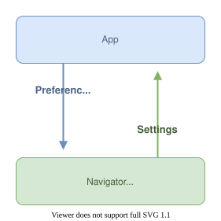

# Configuring the EpubNavigator

The Readium Navigator can be configured dynamically, as it implements the `Configurable` interface.

## Overview

You cannot directly overwrite the Navigator settings. Instead, you submit a set of Preferences to the Navigator, which will then recalculate its settings and update the presentation.

For instance: "font size" is a setting, and the application can submit the font size value `1.5` as a preference.



```js
// 1. Create a set of preferences.
const preferences = {
  fontSize: 1.5,
  lineHeight: 1.75,
  letterSpacing: 0.5,
  wordSpacing: 1
}

// 2. Submit the preferences, the Navigator will update its settings and the presentation.
navigator.submitPreferences(preferences)
```

## Editing Preferences

To assist you in building a preferences user interface or modifying existing preferences, `EpubNavigator` offers a `PreferencesEditor`. This editor includes rules for adjusting preferences, such as the supported values or ranges.

```js
// 1. Create a preferences editor.
const editor = navigator.preferencesEditor;
    
// 2. Modify the preferences through the editor.
editor.backgroundColor.value = "#FFFFFF";
editor.fontSize.increment();
editor.lineHeight.decrement();
editor.textNormalize.toggle();

// 3. Submit the edited preferences
navigator.submitPreferences(editor.preferences)
```

## Preferences are low-level

Preferences are low-level technical properties. While some of them can be exposed directly to the user, such as the font size, others should not be displayed as-is.

For instance, the `layoutStrategy` is a property that works in combination with `minimalLineLength`, `optimalLineLength` and `maximalLineLength`. It is set by the application and not by the user. It is not necessarily meant to be displayed to the user.

## Inactive settings

A setting may be inactive if its activation conditions are not met in a set of preferences. The Navigator will ignore inactive settings when updating its presentation. For example, `noRuby` that can be used to hide ruby annotations, will only be active if the publication language is Japanese.

You can check if a setting is effective for a set of preferences using the PreferencesEditor:

```
const editor = navigator.preferencesEditor;
editor.noRuby.isEffective
```

## Setting the initial Navigator preferences and app defaults

When opening a publication, you can immediately apply the user preferences by providing them to the `EpubNavigator` constructor.

```
const navigator = new EpubNavigator(
  myHTMLElement,
  publication,
  ...
  configuration: {
    preferences: {
      font-size: 1.5,
      line-height: 1.75,
      letter-spacing: 0.5,
      word-spacing: 1
    },
    defaults: {
      minimalLineLength: 20,
      optimalLineLength: 55,
      maximalLineLength: 65
    }
  }
);
```

The `defaults` are used as fallback values when the default Navigator settings are not suitable for your application.

## Building a Settings Interface

TBD.

## Appendix: Preference Constraints

### Reflowable vs fixed-layout

EPUB comes in two very different flavors: reflowable which allows a lot of customization, and fixed-layout which is similar to a PDF or a comic book. Depending on the EPUB being rendered, the `EpubNavigator` will ignore some of the preferences.

| Preference               | Reflowable | Fixed Layout |
| ------------------------ | ---------- | ------------ |
| backgroundColor          | ✅         |              |
| blendFilter              | ✅         | WIP          |
| constraint               | ✅         | WIP          |
| columnCount              | ✅         | (TMP)        |
| darkenFilter             | ✅         | WIP          |
| deprecatedFontSize       | ✅         |              |
| fontFamily               | ✅         |              |
| fontSize                 | ✅         |              |
| fontSizeNormalize        | ✅         |              |
| fontOpticalSizing        | ✅         |              |
| fontWeight               | ✅         |              |
| fontWidth                | ✅         |              |
| hyphens                  | ✅         |              |
| invertFilter             | ✅         | WIP          |
| invertGaijiFilter        | ✅         |              |
| iPadOSPatch              | ✅         |              |
| layoutStrategy           | ✅         |              |
| letterSpacing            | ✅         |              |
| ligatures                | ✅         |              |
| lineHeight               | ✅         |              |
| linkColor                | ✅         |              |
| maximalLineLength        | ✅         |              |
| minimalLineLength        | ✅         |              |
| noRuby                   | ✅         |              |
| optimalLineLength        | ✅         |              |
| pageGutter               | ✅         |              |
| paragraphIndent          | ✅         |              |
| paragraphSpacing         | ✅         |              |
| scroll                   | ✅         |              |
| selectionBackgroundColor | ✅         |              |
| selectionTextColor       | ✅         |              |
| textAlign                | ✅         |              |
| textColor                | ✅         |              |
| textNormalization        | ✅         |              |
| theme                    | ✅         |              |
| visitedColor             | ✅         |              |
| wordSpacing              | ✅         |              |
| zoom                     |            | WIP          |

### Layout Strategy

Layout strategy `columns` is not available in scroll mode (`scroll = true`) or when `columnCount` is not `null`.

### Line length

There is no `lineLength` preference because the effective line length is calculated based on the `optimalLineLength`, `minimalLineLength` and `maximalLineLength` preferences. 

If you prefer to set a line length yourself, you can set `optimalLineLength` to the desired value (`ch|ic` unit) with `layoutStrategy` set to `margins`.

### Scroll vs paginated

The `columnCount` preference is available only when in paginated mode (`scroll = false`).

### Language specific preferences

- `hyphens` is available only for Left-to-Right languages.
- `ligature` is available only when the publication language is Arabic or Persian.
- `noRuby` is available only when the publication language is Japanese.